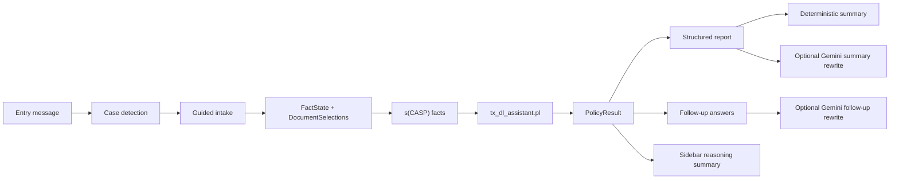

# Architecture

The assistant is split into small modules so the reasoning boundary stays clear:
Python collects facts and formats output, while `scasp/tx_dl_assistant.pl` remains the source of truth for policy decisions.

## Components

- `app.py`: Streamlit chat UI, guided intake, report rendering, follow-up chat, and reasoning sidebar.
- `backend/case_detection.py`: turns a free-text entry into the most likely intake scenario.
- `backend/intake.py`: scenario-specific step definitions and form-to-fact mapping.
- `backend/document_catalog.py`: curated document categories and labels for the guided selectors.
- `backend/gemini_parser.py`: optional Gemini structured-output parser with strict validation and fallback.
- `backend/parser.py`: deterministic free-text parser using regex, keyword mapping, and phrase matching.
- `backend/state_manager.py`: merges parsed facts into persistent conversation state.
- `backend/followup_state.py`: decides whether follow-up messages should update stored facts and document selections.
- `backend/scasp_runner.py`: converts Python facts to s(CASP) predicates, runs `scasp`, and parses JSON output.
- `scasp/tx_dl_assistant.pl`: source of truth for classification, missing information, next question selection, service mode, documents, exams, waivers, and explanations.
- `backend/report_composer.py`: converts policy atoms plus document selections into the structured report model.
- `backend/gemini_summary.py`: optional Gemini summary rewrite grounded in the structured report.
- `backend/followup.py`: deterministic follow-up answers with optional Gemini rewriting.
- `backend/response_generator.py`: maps s(CASP) atoms to user-facing labels and sidebar summaries.

## Runtime Flow

## Reasoning Boundary

Python extracts facts and formats output, but the policy decision comes from s(CASP). Optional Gemini calls may extract structured facts, rewrite the report summary, or lightly rephrase follow-up answers, but they cannot determine the final case, missing information, next question, documents, exams, waivers, service mode, or explanations. If the `scasp` executable is unavailable, the app reports a setup error rather than substituting another reasoning engine.
